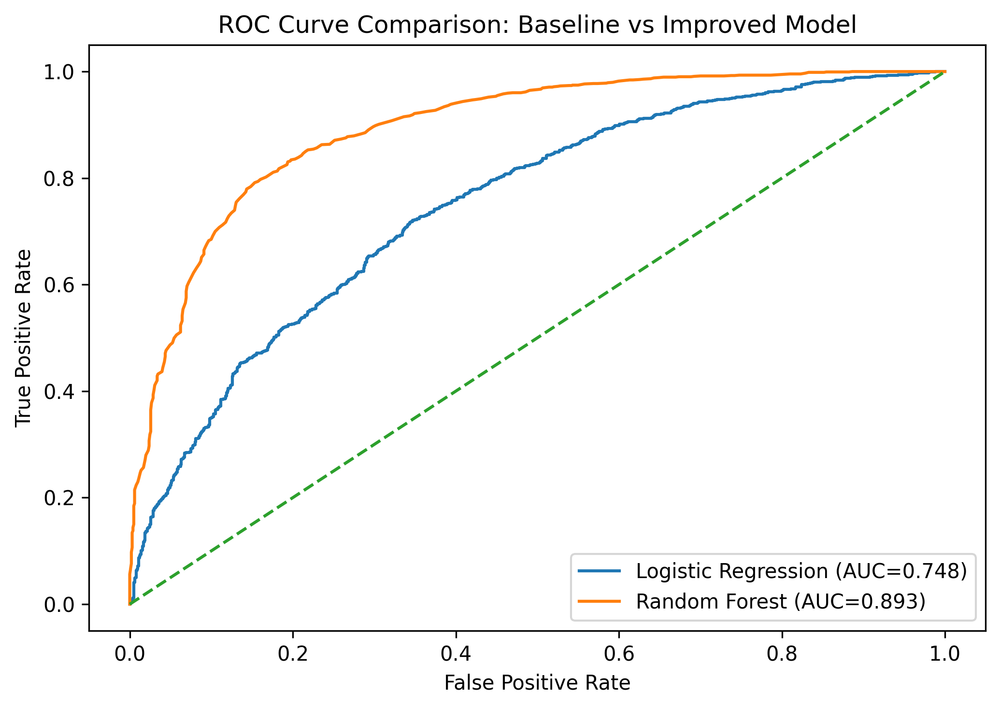
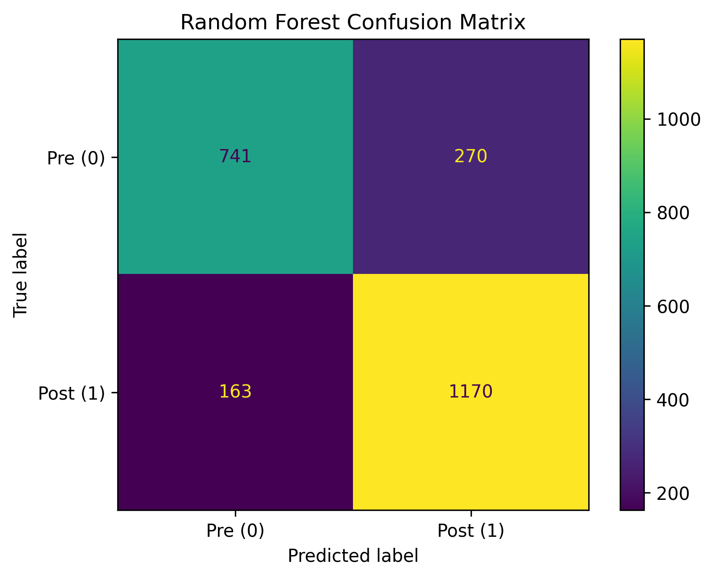
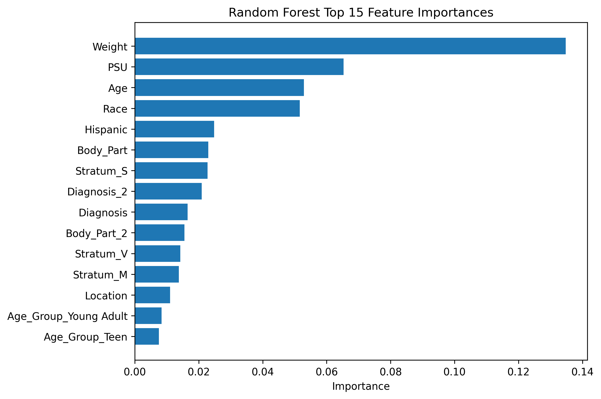

# Skiing and Snowboarding Injury Analysis
Machine learning analysis of skiing and snowboarding injuries using the NEISS dataset (2016–2024).

## Example Model Outputs

### ROC Curve

### Random Forest Confusion Matrix

### Feature Importance

